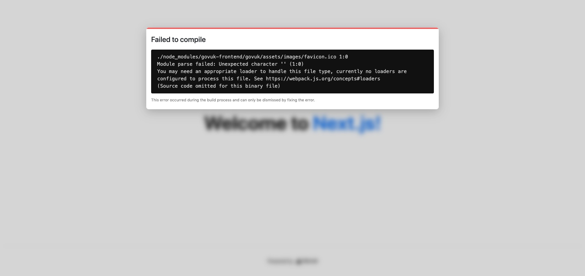

# GOV.UK React components (govuk-react-jsx) with Next JS Compatibility Issues

Following steps to install GOV.UK React components using https://github.com/surevine/govuk-react-jsx
produces the following error.




## Steps to recreate

Example is based on using basic starter template from [Learn Next.js](https://nextjs.org/learn).

Create Next Js project:
```
npx create-next-app nextjs-blog --use-npm --example "https://github.com/vercel/next-learn-starter/tree/master/learn-starter"
```

Install dependencies from:

https://github.com/surevine/govuk-react-jsx


## Text build errors

```
info  - Creating an optimized production build  
Failed to compile.

./node_modules/govuk-frontend/govuk/assets/images/favicon.ico 1:0
Module parse failed: Unexpected character '' (1:0)
You may need an appropriate loader to handle this file type, currently no loaders are configured to process this file. See https://webpack.js.org/concepts#loaders
(Source code omitted for this binary file)


> Build error occurred
Error: > Build failed because of webpack errors
    at /govuk-nextjs-example/node_modules/next/dist/build/index.js:15:918
    at async /govuk-nextjs-example/node_modules/next/dist/build/tracer.js:1:1441

```
